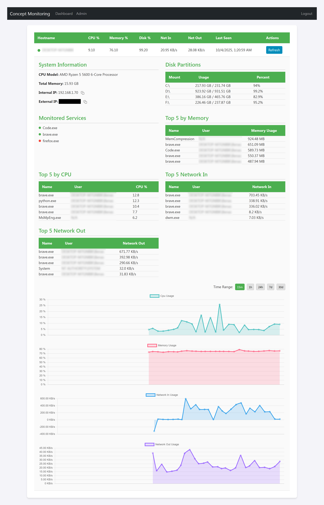

# Concept Monitoring - Device Monitoring Dashboard

> **Note:** This is a proof-of-concept project. It is not intended for production use.

A simple, web-based dashboard for monitoring system metrics from multiple devices. It consists of a Python-based server and a client agent that reports metrics.



## Features

- **Real-time Monitoring**: View live metrics for CPU, memory, disk, and network usage.
- **Multi-Device Support**: Monitor multiple client agents from a single dashboard.
- **Historical Data**: Charts show metric history over selectable time ranges (15m, 1h, 24h, 7d, 30d).
- **Process Information**: See the top 5 processes by CPU, memory, and network usage.
- **Service Monitoring**: Configure clients to watch specific services (e.g., 'nginx', 'mysql') and display their status.
- **Alerting**: Set thresholds for CPU, memory, and disk usage to receive Discord webhook notifications.
- **Remote Actions**: Remotely trigger a data refresh on a client.

## Setup & Installation

### 1. Clone the Repository

```bash
git clone https://github.com/D221/concept-monitoring
cd concept-monitoring
```

### 2. Server Setup

Navigate to the server directory.

```bash
cd server
```

Install the required packages.

```bash
pip install -r requirements.txt
```

Create a `.env` file from the example and edit it. A secret key is required.

```bash
cp .env.example .env
# Open .env and set your FLASK_SECRET_KEY
```

### 3. Client Setup

Navigate to the client directory.

```bash
cd client
```

Install the required packages.

```bash
pip install -r requirements.txt
```

Create a `.env` file and configure the `SERVER_URL` to point to your server's address.

```bash
cp .env.example .env
# Open .env and set SERVER_URL (e.g., http://192.168.1.100:5000)
```

## How to Run

### 1. Start the Server

Navigate to the `server` directory and run the Flask application.

```bash
cd server
python app.py
gunicorn -w 4 -b 0.0.0.0:5000 server.app:app # on Linux
```

The server will start on `0.0.0.0:5000` by default. You can access the dashboard by navigating to `http://<your-server-ip>:5000` in your web browser.

- **Default login**: `admin` / `admin`

### 2. Start the Client

On each device you want to monitor, navigate to the `client` directory and run the agent.

```bash
cd client
python client.py
```

The client will start collecting metrics and reporting them to the server. The device will appear on the dashboard within a few moments.

## Configuration

- **Client**: In the `client/.env` file, you can configure:
    - `SERVER_URL`: The address of the monitoring server.
    - `REPORT_INTERVAL`: How often (in seconds) to send a full report to the server.
    - `SERVICES_TO_MONITOR`: A comma-separated list of process names to monitor (e.g., `nginx,sshd,mysql`).
    - `FETCH_EXTERNAL_IP`: Set to `0` to disable fetching the external IP address.

## Docker

This project can be run using Docker. Dockerfiles are provided for both the client and the server.

### Prerequisites

- [Docker](https.docker.com/get-started) installed on your system.

### Server

To build and run the server image:

```bash
cd server
docker build -t concept-monitoring-server .
docker run -d -p 5000:5000 --name concept-monitoring-server concept-monitoring-server
```

The server will be available at `http://localhost:5000`.

### Client

To build and run the client image:

```bash
cd client
docker build -t concept-monitoring-client .
docker run -d --network="host" --name concept-monitoring-client concept-monitoring-client
```

**Note:** The client is configured to connect to the server at `http://127.0.0.1:5000` by default. If your server is running on a different host or port, you will need to update the `SERVER_URL` environment variable in the `client/.env` file and rebuild the image, or pass the environment variable to the `docker run` command:

```bash
docker run --network="host" -e SERVER_URL=http://<your-server-ip>:<port> --name concept-monitoring-client concept-monitoring-client
```
The `--network="host"` flag is used to allow the client to access the host's network, which is useful for collecting network metrics and connecting to a server running on the same host.

### Using Docker Compose

To simplify running both the server and client, a `docker compose.yml` file is provided.

From the root of the project, run:

```bash
docker compose up --build
```

This will build the images for both the server and the client, and start the containers. The server will be available at `http://localhost:5000`.

To run in detached mode:
```bash
docker compose up --build -d
```

To stop the containers:
```bash
docker compose down
```

### Running Tests

To run the tests for the server, you can use the `test` service defined in the `docker-compose.yml` file.

From the root of the project, run:
```bash
docker compose run --build test
```

This command will build the server image (if it doesn't exist) and run the `pytest` tests inside a container.


